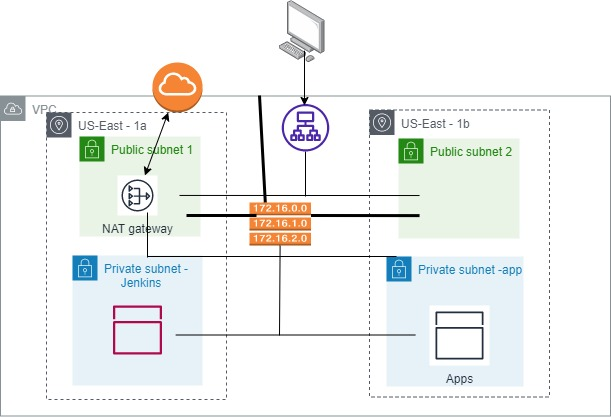

# finalassignmentterraform

1. Create a AWS EC2 instance in US-East region and install terraform  
2. Clone the code from repo  
3. Use all the scripts in the scripts folder  
4. Run the terraform files to set up the infra. We will get the alb link once alb.tf file completes the execution  
5. Use the jump-key to log into the jump server. Install ansible on the jump server  
6. Using ansible playbook file install docker and java on the host machines  
7. In the private subnet security group open the inboud rule for ALB security group  
8. Log into jenkins machine using the jump-key file and run the jenkins docker using   
   docker container run -d -p 8080:8080 -v jenkins:/var/jenkins_home --name jenkins-local env JENKINS_OPTS="--prefix=/jenkins jenkins/jenkins:lts  
9. Using the jenkins job file create a job to run on the app node and build and deploy the app using the job  
10. Access the applciation using ALB/app  

